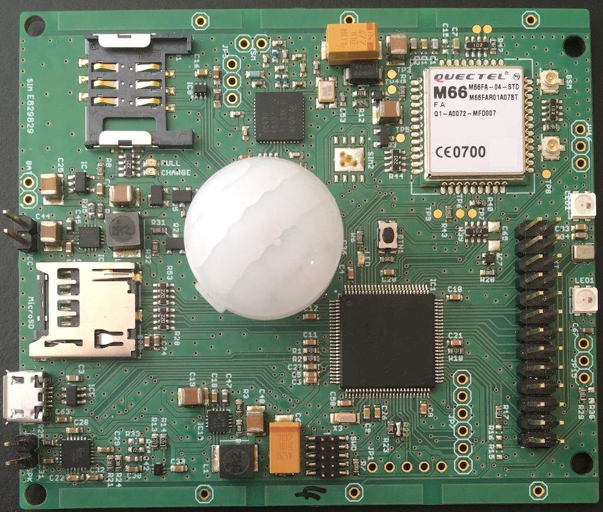

# ubirch#1 r0.3-k (Kokeshi) board specific implementation

This is the ubirch#1 board revision 0.3 (special version k0.1, Kokeshi).
This board contains almost the same components as the r0.2 with a different cell-chip (Quectel M66)
and no extra ECC chip. Additionally components, such as extra LEDs, a PIR, SDHC slot, and audio hardware.
This board also features a sub-1GHz RF module.

* programmable via USB or JTAG (SWD, JLink Debug Probe)
* serial debug console is configured on PTB16 (RX) and PTB17 (TX)

## Flashing

Entering bootloader mode:
1. __Initial__ (necessary once): The board must be reset into bootloader mode. This is done by removing the USB/Power, then pressing
the button on-board (keep pressed) and re-inserting the USB cable. Now the board is in bootloader mode.
2. __Firmware__: After flashing using the latest firmware entering the bootloader mode is just a
matter of pressing the button once.

If you use the [cmake build toolchain](https://github.com/ubirch/ubirch-arm-toolchain), the `-flash` target for your
project will be configured to use the `blhost` tool coming with the toolchain to flash directly via USB.

The commands it executes are:

- `blhost -u -- flash-erase-all`
- `blhost -u -- write-memory 0x0 target-executable.bin`
- `blhost -u -- reset`

These commands, erase flash, write the binary and reset the board.

## Connectors

Debug console output can be found on pins 6 (RX) and 7 (TX). If the USB port is at the bottom,
then pin 1 is in the top right corner of the board

```
25 23 21 19 17 15 13 11 9  5  3  3  1
o  o  o  o  o  o  o  o  o  o  o  o  ⚀
o  o  o  o  o  o  o  o  o  o  o  o  o
26 24 22 20 18 16 14 12 10 8  6  4  2
```

The pin configuration is as follows:

```
 1 = A1         PTB2   |  2 = A2          PTB3
 3 = D1         PTB9   |  4 = I2C_SCL     PTB10
 5 = I2C_SDA    PTB11  |  6 = UART_RX     PTB16
 7 = UART_TX    PTB17  |  8 = T1          PTB18
 9 = GND               | 10 = switchable  VDD
11 = T2         PTB19  | 12 = SPI2_CS0    PTB20
13 = SPI2_SCK   PTB21  | 14 = SPI2_MOSI   PTB22
15 = SPI2_MISO  PTB23  | 16 = UART2_RTS   PTC1
17 = SPI0_CS4   PTC0   | 18 = UART2_CTS   PTC2
19 = UART2_RX   PTC3   | 20 = UART2_TX    PTC4
21 = SPI0_SCK   PTC5   | 22 = SPI0_MOSI   PTC6
23 = SPI0_MISO  PTC7   | 24 = permanent   VDD
25 = GND               | 26 = switchable  VDD
```


